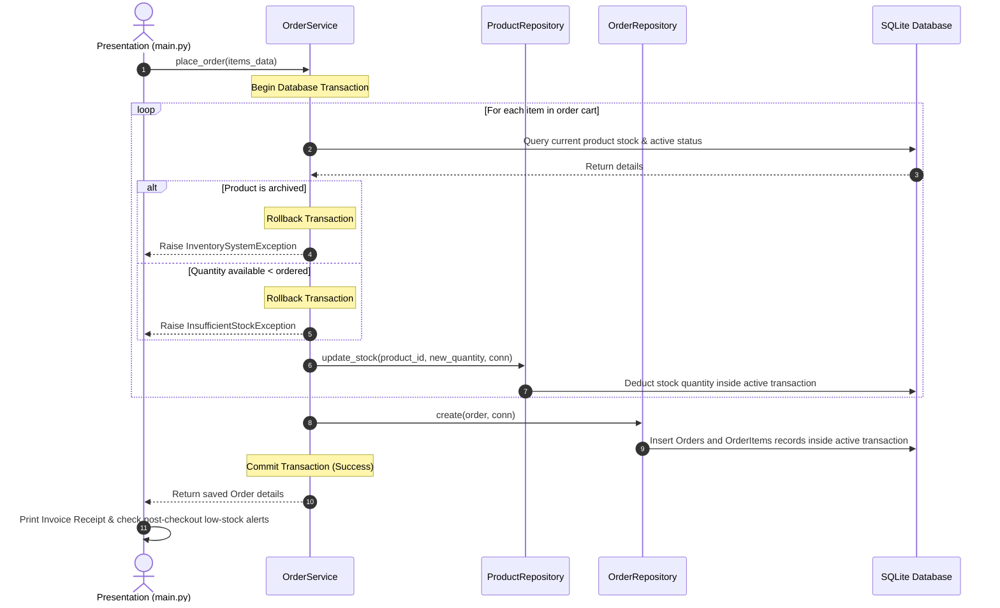

# Smart E-Commerce Inventory & Order Management System

[](https://www.python.org/)
[](https://www.sqlite.org/)
[](https://github.com/Textualize/rich)
[](tests/)
[](#architecture)

A Python-based Inventory and Order Management System built using Clean Architecture principles and SQLite.
---

## 📖 Table of Contents
1. [Project Overview](#project-overview)
2. [Key Features](#key-features)
3. [Technology Stack](#technology-stack)
4. [Architecture & Folder Structure](#architecture--folder-structure)
5. [System Workflow](#system-workflow)
6. [Setup & Installation Instructions](#setup--installation-instructions)
7. [Sample Inputs & Outputs](#sample-inputs--outputs)
8. [E-Commerce System Focus: Advanced Implementations](#Retail-System-focus-advanced-implementations)
9. [Recruiter Resources](#recruiter-resources)
   * [Skills Demonstrated](#skills-demonstrated)
   * [Developer Guide](SYSTEM_GUIDE.md)
   * [Interview Questions & Answers](SYSTEM_DESIGN.md)
10. [Future Enhancements](#future-enhancements)

---

## 🌟 Project Overview

Inventory management involves coordinating multiple backend operations such as stock updates during orders, preserving sales history when products are archived, and generating basic analytics for business insights.

This project implements a modular, testable, and robust solution to these requirements using a Command Line Interface (CLI) made with the `rich` library.

---

## ⚡ Key Features

### 1. Product Catalog Management
* **Active catalog view**: Filter out archived products from normal buyer viewing.
* **Archiving (Soft Delete)**: Prevent permanent deletion of products that have historical orders to protect referential integrity, while hiding them from active search.
* **Domain Validations**: Checks for negative prices, stock, and low stock thresholds on input.

### 2. Transaction-Safe Order Processing
* **Multi-item order checkout**: Place order containing multiple different items in a single go.
* **ACID Transactions**: Uses SQLite transaction rollback context managers. If one product lacks stock during checkout, all stock deductions are rolled back (all-or-nothing).
* **Automatic Stock Alerts**: Triggers real-time warnings in the console if stock levels fall below thresholds after order placement.

### 3. Business Analytics & Reporting
* **Sales Analytics Dashboard**: Reports completed orders, gross revenue, average order value, and category breakdowns.
* **Inventory Valuation Dashboard**: Reports unique SKUs, stock volume, portfolio value, average price, and category breakdowns.
* **Top Selling Products**: Computes ranks, units sold, and revenues for the top 5 products using database-level aggregation.
* **CSV Exports**: Export sales and inventory valuation dashboards to local CSV sheets.

### 4. Code Health & Diagnostics
* **Auditing (Logging)**: Writes system actions, warnings, and database integrity failures to a local log file (`system.log`).
* **Test Suite**: Includes 14 automated unit tests verifying the business logic under `tests/`.

---

## 🛠️ Technology Stack
* **Language**: Python 3.8+ (no heavy framework dependencies)
* **Database**: SQLite3 (embedded relational database)
* **UI styling**: [Rich](https://github.com/Textualize/rich) (Rich text formatting, panels, alerts, and tables in terminal)
* **Testing**: Python Standard `unittest` framework

---

## 📐 Architecture & Folder Structure

This project follows **Clean Architecture** patterns, separating database logic, domain models, business use-cases, and visual interfaces.

```
smart_inventory_system/
│
├── README.md               # Main repository documentation
├── SYSTEM_GUIDE.md        # Plain English guide for Developers
├── SYSTEM_DESIGN.md       # Recruiter questions and system design answers
├── requirements.txt        # Third-party dependency list
├── .gitignore              # Files to exclude from Git tracking
├── main.py                 # CLI Interface and entrypoint
├── system.log              # Automatically generated system log audits
│
├── database/
│   ├── __init__.py
│   ├── connection.py       # Thread-safe SQLite connection & transaction manager
│   └── schema.sql          # DB schema, indexes, constraints, and relationships
│
├── models/
│   ├── __init__.py
│   ├── product.py          # Product Domain Model (validations, low-stock properties)
│   └── order.py            # Order and OrderItem models (calculators)
│
├── repositories/
│   ├── __init__.py
│   ├── base_repository.py  # Repository base class sharing connection managers
│   ├── product_repository.py # Product SQL queries, stock edits, soft deletes
│   └── order_repository.py # Order and OrderItem database creation queries
│
├── services/
│   ├── __init__.py
│   ├── inventory_service.py # Core stock-level tracking and restocking logic
│   ├── order_service.py    # Checkout transaction controls & inventory updates
│   └── report_service.py   # SQL-aggregated sales and inventory reporting
│
├── exceptions/
│   ├── __init__.py
│   └── custom_exceptions.py # Domain exceptions (e.g. ProductInUse, InsufficientStock)
│
├── utils/
│   ├── __init__.py
│   └── helpers.py          # Invoice text generator, CSV exports helpers
│
└── tests/                  # Test directory containing 14 test cases
    ├── __init__.py
    ├── test_products.py    # Tests CRUD & domain validation
    ├── test_inventory.py   # Tests restock & low stock alert limits
    └── test_orders.py      # Tests transaction rollback, soft delete rules
```

### Clean Architecture Dependency Rule
The code is designed so that dependencies point inward:
`Presentation (main.py) ➔ Services ➔ Repositories ➔ Models (Core Domain)`
The core domain models (`Product`, `Order`) have absolutely zero dependencies on database engines or external UI libraries, making them highly reusable.

---

## 🔄 System Workflow



---

## 🚀 Setup & Installation Instructions

### Prerequisites
* Ensure Python 3.8+ is installed on your computer. You can check your version by running:
  ```bash
  python --version
  ```

### 1. Clone & Navigate to Project
Copy the project code to your local directory and enter it:
```bash
cd smart_inventory_system
```

### 2. Create and Activate Virtual Environment (Recommended)
Creating a virtual environment ensures dependencies do not conflict with your system-wide packages:
* **Windows (PowerShell/CMD):**
  ```powershell
  python -m venv venv
  venv\Scripts\activate
  ```
* **macOS/Linux:**
  ```bash
  python3 -m venv venv
  source venv/bin/activate
  ```

### 3. Install Dependencies
Install the required console interface library:
```bash
pip install -r requirements.txt
```

### 4. Run the Application
Start the interactive command line program:
```bash
python main.py
```
*Tip: On first launch, select option **14** in the menu to seed the database with mock catalog items and orders. This lets you run reports and checkout tests immediately!*

### 5. Running Automated Tests
Run the entire unit test suite containing 14 scenarios to verify the application:
```bash
python -m unittest discover -s tests
```

---

## 📸 Screenshots Placeholders
*Below are visual panels rendered by the terminal CLI application.*

### Main Navigation Menu Dashboard
```
┌─────────────────────────────────────────────────────────────┐
│                      Welcome to Smart                       │
│             Inventory & Order Management System             │
└─────────────────────────────────────────────────────────────┘
* Selection Table showing: Product CRUD, Restocking, Checkout,
  Sales Report (with CSV export), Inventory status and Mock Seeder.
```

### Sales Reporting Panel
```
┌─────────────────────────── Sales Summary ──────────────────┐
│  Total Completed Orders : 3                                 │
│  Total Gross Revenue    : $1844.95                          │
│  Average Order Value    : $614.98                           │
│  Total Products Sold    : 10 units                          │
└─────────────────────────────────────────────────────────────┘
```

---
## 📊 System Highlights

- Transaction-safe order processing using SQLite
- Soft delete (archiving) instead of permanent deletion
- Modular architecture using Clean Architecture principles
- Basic audit logging for system actions

---

## 💼 Skills Demonstrated

* **Software Architecture**: Clean Architecture, Separation of Concerns, Single Responsibility Principle.
* **Database Engineering**: Normalized Schema (3NF), Transaction Isolation (ACID), Foreign Keys, Check Constraints, SQL Indices, Aggregations.
* **Backend Logic**: State Validations, Custom Exceptions, Defensive Programming.
* **Object-Oriented Programming**: Data Encapsulation, Domain Modeling, Interface Separation.
* **Unit Testing**: Test-Driven Development patterns, Mock Testing.

---

## 📈 Future Enhancements
* **REST API Layer**: Add FastAPI wrapper to convert the business logic into microservices.
* **Authentication**: Integrate JWT auth for admin dashboard and shopper checkout roles.
* **Relational DBMS**: Port SQLite connection adapters to PostgreSQL for multi-user scaling.
